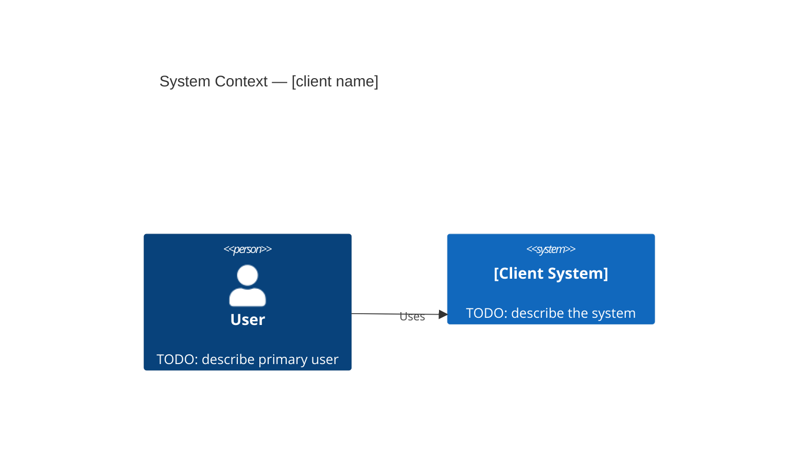
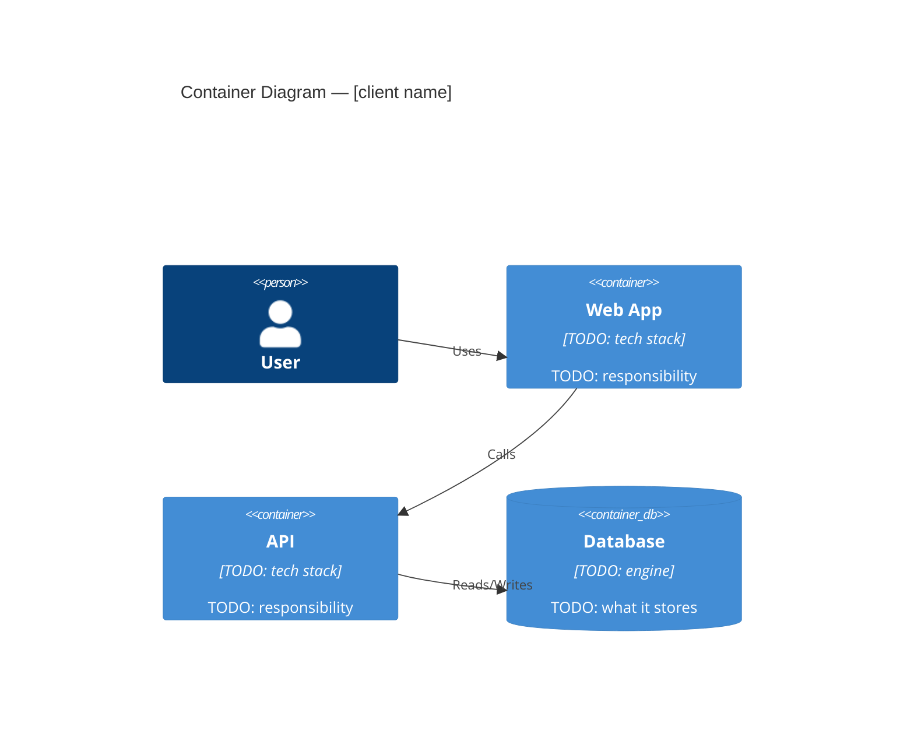

# Architecture

## C4 Level 1 — System Context

## C4 Level 2 — Container

## Invariants

<!-- TODO: populate for [client name] -->

## Key decisions

See `DECISIONS.md` and `docs/decisions/` for ADRs.
